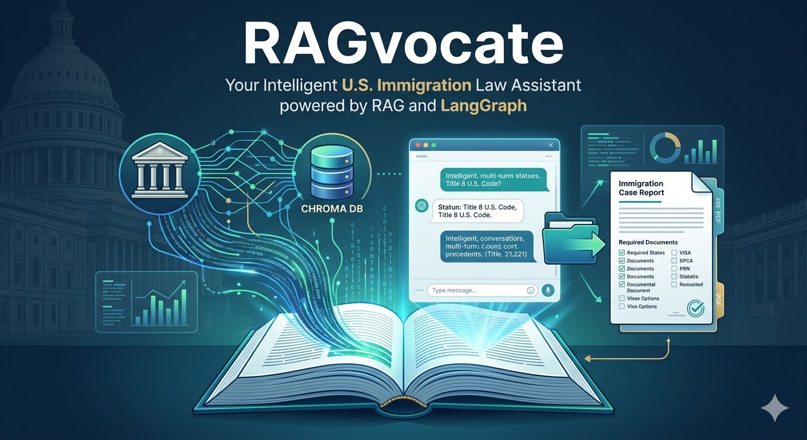
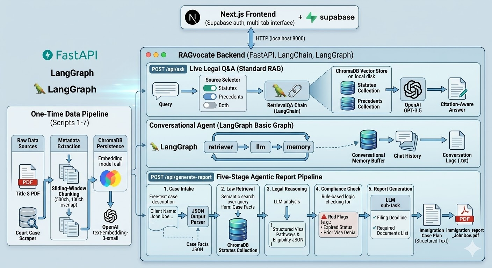

# RAGvocate



A Retrieval-Augmented Generation (RAG) legal assistant specializing in U.S. immigration law. RAGvocate combines a FastAPI backend powered by LangChain and LangGraph with a Next.js frontend to provide intelligent legal Q&A, conversational memory, and automated immigration case report generation.

---

## Table of Contents

- [Overview](#overview)
- [Features](#features)
- [Architecture](#architecture)
- [Tech Stack](#tech-stack)
- [Project Structure](#project-structure)
- [Data Pipeline](#data-pipeline)
- [API Reference](#api-reference)
- [Setup & Installation](#setup--installation)
  - [Backend](#backend-setup)
  - [Frontend](#frontend-setup)
  - [Docker](#docker)
- [Environment Variables](#environment-variables)
- [Running the Application](#running-the-application)
- [Testing](#testing)
- [LangGraph Workflows](#langgraph-workflows)

---

## Overview

RAGvocate indexes two legal knowledge bases — U.S. **immigration statutes** (Title 8, U.S. Code) and **landmark court precedents** — into ChromaDB vector stores. Users interact through a chat interface that routes queries to the appropriate knowledge source and returns grounded, citation-aware answers. A separate agentic pipeline can take a natural-language case description and produce a structured immigration case plan, complete with visa options, compliance risks, required documents, filing deadlines, and a downloadable PDF report.

---

## Features

### Core Q&A
- **Statute search** — queries against Title 8 U.S. Code (Immigration and Nationality Act)
- **Precedent search** — queries against indexed landmark U.S. immigration court cases
- **Combined search** — queries both knowledge bases simultaneously and returns merged answers
- **Configurable retrieval** — top-k document retrieval with adjustable `k` parameter

### Conversational Agent (LangGraph)
- Multi-turn conversation with persistent chat history
- Context-aware answers that reference prior exchange
- Conversation logs saved to disk as timestamped `.txt` files

### Immigration Report Generator
A five-stage agentic pipeline that processes a free-text case description and outputs a structured report:

1. **Case Intake** — extracts structured facts (name, nationality, visa history, current status) using a JSON output parser
2. **Law Retrieval** — retrieves relevant statutes from the vector store based on extracted case facts
3. **Legal Reasoning** — determines visa pathways, eligibility, and recommended action plan
4. **Compliance Check** — flags any prior denials, expired statuses, or procedural risks
5. **Report Generation** — assembles a client-ready case plan with required documents, LLM-calculated filing deadline, and exports it as a PDF

### Frontend
- Supabase-based user authentication (sign-up / sign-in / sign-out)
- Multi-tab conversation interface — open and manage several parallel chats
- Search scope selector — choose Statutes, Precedents, or Both per conversation
- Knowledge base summary panel showing indexed document counts
- Export any conversation to a `.txt` file
- Responsive UI built with shadcn/ui components

---

## Architecture



```
┌──────────────────────────────────────────────────────────────────────┐
│                          Frontend (Next.js)                          │
│  AuthForm → Chat UI → ConversationTabs → SearchScopeSelector         │
│  api.ts → fetch POST /api/ask | /api/ask/langgraph | /api/generate-report │
└─────────────────────────────┬────────────────────────────────────────┘
                              │ HTTP (localhost:8000)
┌─────────────────────────────▼────────────────────────────────────────┐
│                       Backend (FastAPI)                              │
│                                                                      │
│  POST /api/ask ──────────────► RetrievalQA (statutes | precedents)   │
│                                                                      │
│  POST /api/ask/langgraph ────► LangGraph Basic Graph                 │
│                                 retrieve → llm → memory → END        │
│                                                                      │
│  POST /api/generate-report ─► LangGraph Report Agent                │
│                                intake → retrieve_laws → analyze      │
│                                → compliance → report → END           │
└──────────────┬───────────────────────────────────────────────────────┘
               │
┌──────────────▼─────────────────┐
│        ChromaDB (local disk)   │
│  ┌─────────────────────────┐   │
│  │  statutes collection    │   │
│  └─────────────────────────┘   │
│  ┌─────────────────────────┐   │
│  │  precedents collection  │   │
│  └─────────────────────────┘   │
└────────────────────────────────┘
```

---

## Tech Stack

### Backend
| Component | Technology |
|-----------|-----------|
| Web framework | FastAPI 0.116 + Uvicorn |
| LLM | OpenAI GPT-3.5-turbo (via `langchain-openai`) |
| Embeddings | OpenAI `text-embedding-3-small` |
| Orchestration | LangChain 0.3 + LangGraph 0.5 |
| Vector store | ChromaDB 1.0 (`langchain-chroma`) |
| PDF extraction | pdfplumber |
| Web scraping | requests + BeautifulSoup4 |
| PDF generation | fpdf |
| Observability | LangSmith (LangChain tracer) |
| Dependency mgmt | Poetry |
| Language | Python 3.10–3.12 |

### Frontend
| Component | Technology |
|-----------|-----------|
| Framework | Next.js 15 (App Router) |
| Language | TypeScript 5.2 |
| UI library | shadcn/ui (Radix UI primitives) |
| Styling | Tailwind CSS 3.3 |
| Auth | Supabase JS v2 |
| Icons | lucide-react |
| State | React hooks + localStorage persistence |

### Infrastructure
| Component | Technology |
|-----------|-----------|
| Containerization | Docker (python:3.10-slim) |
| Auth backend | Supabase |

---

## Project Structure

```
ragvocate/
├── backend/
│   ├── app/
│   │   ├── main.py                        # FastAPI app entry point, CORS config
│   │   ├── api/
│   │   │   └── routes.py                  # All API route handlers
│   │   ├── core/
│   │   │   ├── embedding_loader.py        # ChromaDB vectorstore loader
│   │   │   ├── rag.py                     # RetrievalQA and graph factory functions
│   │   │   ├── langgraph_basic.py         # Conversational LangGraph (retrieve→llm→memory)
│   │   │   └── langgraph_report_agent.py  # 5-stage immigration report agent + PDF export
│   │   └── tests/
│   │       └── test_rag.py                # Parametrized pytest suite for /api/ask
│   ├── scripts/
│   │   ├── 1_statutes_pdf_txt-md_extract.py     # PDF → per-section .txt + metadata JSON
│   │   ├── 2_precedents_scraper.py              # SerpAPI + LII scraper for case summaries
│   │   ├── 3_precedents_metadata.py             # Metadata extraction for precedents
│   │   ├── 4_statutes_chunking_processor.py     # Sliding-window chunking → JSONL
│   │   ├── 5_precedents_chunking_processor.py   # Sliding-window chunking → JSONL
│   │   ├── 6_build_vectorstore_statutes.py      # Build + persist statutes ChromaDB
│   │   └── 7_build_vectorstore_precedents.py    # Build + persist precedents ChromaDB
│   ├── Dockerfile
│   ├── pyproject.toml
│   └── .env.example
└── frontend/
    ├── app/
    │   ├── layout.tsx
    │   └── page.tsx                       # Main chat UI
    ├── components/
    │   ├── ConversationTabs.tsx           # Tab bar for multiple conversations
    │   ├── DocumentUpload.tsx             # Document upload component
    │   ├── SearchScopeSelector.tsx        # Statutes / Precedents / Both toggle
    │   └── auth/
    │       ├── AuthForm.tsx               # Sign-in / sign-up form
    │       └── UserMenu.tsx               # Signed-in user dropdown
    ├── hooks/
    │   ├── useAuth.ts                     # Supabase auth state hook
    │   └── useLocalStorage.ts             # Persistent state hook
    ├── lib/
    │   ├── api.ts                         # LegalRAGAPI client class
    │   └── supabase.ts                    # Supabase client init
    ├── types/
    │   └── api.ts                         # Shared TypeScript interfaces
    └── package.json
```

---

## Data Pipeline

The seven numbered scripts under `backend/scripts/` must be run once in order to build the knowledge bases before starting the API server.

### Step 1 — Extract Statutes from PDF
`1_statutes_pdf_txt-md_extract.py`

Reads `USCODE-2023-title8.pdf` using pdfplumber. Handles the two-column layout, parses section boundaries with regex (`§NNN`), and saves each statute section as an individual `.txt` file plus a companion `_metadata.json` file. Tracks subchapter and part hierarchy throughout.

**Input:** `$PDF_PATH`
**Output:** `$STATUTES_RAW_TEXT/*.txt`, `$STATUTES_RAW_META/*_metadata.json`

### Step 2 — Scrape Court Precedents
`2_precedents_scraper.py`

Uses SerpAPI to locate each case on Cornell Law's Legal Information Institute (LII), then scrapes the case summary with BeautifulSoup. Includes a 2-second delay between requests.

Indexed cases include: *US v. Wong Kim Ark*, *INS v. Cardoza-Fonseca*, *Plyler v. Doe*, *Vartelas v. Holder*, and 12 others.

**Output:** `$PRECEDENTS_RAW_TEXT/*.txt`

### Step 3 — Extract Precedent Metadata
`3_precedents_metadata.py`

Extracts and normalizes metadata from the scraped precedent text files.

**Output:** `$PRECEDENTS_RAW_META/*_metadata.json`

### Step 4 & 5 — Chunk Documents
`4_statutes_chunking_processor.py` / `5_precedents_chunking_processor.py`

Applies a sliding-window chunking strategy:
- Chunk size: **500 characters**
- Overlap: **100 characters**

Outputs each chunk as a JSONL record with `id`, `text`, and `metadata` fields.

**Output:** `$STATUTES_PROCESSED_TEXT/statutes_chunks.jsonl`, `$PRECEDENTS_PROCESSED_TEXT/precedents_chunks.jsonl`

### Step 6 & 7 — Build Vector Stores
`6_build_vectorstore_statutes.py` / `7_build_vectorstore_precedents.py`

Reads the JSONL chunks, embeds each one using OpenAI `text-embedding-3-small`, and persists the resulting ChromaDB collection to disk.

**Output:** `$STATUTES_VECTORSTORE/`, `$PRECEDENTS_VECTORSTORE/`

---

## API Reference

All endpoints are served under the `/api` prefix.

### `POST /api/ask`

Standard RAG query using a `RetrievalQA` chain (top-4 retrieval).

**Request body:**
```json
{
  "query": "Who qualifies for asylum under U.S. immigration law?",
  "source": "statutes" | "precedents" | "both"
}
```

**Response:**
```json
{
  "answer": "..."
}
```

When `source` is `"both"`, the response concatenates results from both knowledge bases under `[Statutes]` and `[Precedents]` labels.

---

### `POST /api/ask/langgraph`

Conversational query with in-session chat history. Uses a three-node LangGraph: `retriever → llm → memory`.

**Request body:**
```json
{
  "query": "What visa options does a denied H-1B applicant have?"
}
```

**Response:**
```json
{
  "answer": "..."
}
```

Chat history is preserved across calls within the same server session and also saved to disk as a timestamped `.txt` file.

---

### `POST /api/generate-report`

Runs the full five-stage immigration case analysis pipeline and returns structured results. Also generates a PDF file named `immigration_report_<Client_Name>.pdf` in the working directory.

**Request body:**
```json
{
  "user_input": "My name is John Doe, I am from Mexico, currently on an expired H-1B visa. I previously held an F-1 visa for 4 years."
}
```

**Response:**
```json
{
  "report_text": "IMMIGRATION CASE PLAN\n\nClient: John Doe\n...",
  "facts": {
    "name": "John Doe",
    "country_of_origin": "Mexico",
    "current_status": "expired",
    "visa_history": [...]
  },
  "legal_options": [...],
  "compliance_issues": [...]
}
```

---

## Setup & Installation

### Prerequisites

- Python 3.10–3.12
- Node.js 18+
- [Poetry](https://python-poetry.org/docs/#installation)
- An OpenAI API key
- (Optional) A LangSmith account for tracing
- (Optional) A Supabase project for frontend auth

---

### Backend Setup

```bash
cd backend

# Install dependencies
poetry install

# Copy and populate environment variables
cp .env.example .env
# Edit .env — see Environment Variables section below

# Run the data pipeline (one-time setup)
poetry run python scripts/1_statutes_pdf_txt-md_extract.py
poetry run python scripts/2_precedents_scraper.py
poetry run python scripts/3_precedents_metadata.py
poetry run python scripts/4_statutes_chunking_processor.py
poetry run python scripts/5_precedents_chunking_processor.py
poetry run python scripts/6_build_vectorstore_statutes.py
poetry run python scripts/7_build_vectorstore_precedents.py

# Start the API server
poetry run uvicorn app.main:app --reload --port 8000
```

The API will be available at `http://localhost:8000`.

---

### Frontend Setup

```bash
cd frontend

# Install dependencies
npm install

# Create environment file
cp .env.example .env.local
# Add NEXT_PUBLIC_SUPABASE_URL, NEXT_PUBLIC_SUPABASE_ANON_KEY, and NEXT_PUBLIC_API_URL

# Start the dev server
npm run dev
```

The frontend will be available at `http://localhost:3000`.

---

### Docker

The backend can be run as a Docker container:

```bash
cd backend

# Build the image
docker build -t ragvocate-backend .

# Run the container (mount your data directory and pass env vars)
docker run -p 8000:8000 \
  --env-file .env \
  -v $(pwd)/data:/app/data \
  ragvocate-backend
```

The Dockerfile uses `python:3.10-slim`, installs Poetry, and starts Uvicorn on port 8000.

---

## Environment Variables

### Backend (`.env`)

| Variable | Description |
|----------|-------------|
| `OPENAI_API_KEY` | OpenAI API key for LLM and embeddings |
| `STATUTES_VECTORSTORE` | Absolute path to the ChromaDB statutes collection directory |
| `PRECEDENTS_VECTORSTORE` | Absolute path to the ChromaDB precedents collection directory |
| `PDF_PATH` | Path to the source `USCODE-2023-title8.pdf` file |
| `STATUTES_RAW_TEXT` | Output directory for extracted statute `.txt` files |
| `STATUTES_RAW_META` | Output directory for statute metadata JSON files |
| `STATUTES_PROCESSED_TEXT` | Output directory for the statutes JSONL chunks file |
| `PRECEDENTS_RAW_TEXT` | Output directory for scraped precedent `.txt` files |
| `PRECEDENTS_RAW_META` | Output directory for precedent metadata JSON files |
| `PRECEDENTS_PROCESSED_TEXT` | Output directory for the precedents JSONL chunks file |
| `LANGCHAIN_API_KEY` | LangSmith API key (optional, for tracing) |
| `LANGCHAIN_ENDPOINT` | LangSmith endpoint URL (optional) |
| `LANGCHAIN_PROJECT` | LangSmith project name (optional) |
| `EMBEDDING_MODEL` | Embedding model name override (optional) |
| `MODEL_PATH` | Local model path override (optional) |

### Frontend (`.env.local`)

| Variable | Description |
|----------|-------------|
| `NEXT_PUBLIC_SUPABASE_URL` | Your Supabase project URL |
| `NEXT_PUBLIC_SUPABASE_ANON_KEY` | Your Supabase anonymous/public key |
| `NEXT_PUBLIC_API_URL` | Backend base URL (defaults to `http://localhost:8000`) |

---

## Running the Application

With both servers running:

1. Open `http://localhost:3000` in your browser
2. Sign up or sign in with your email and password (Supabase auth)
3. Select a search scope: **Statutes**, **Precedents**, or **Both**
4. Type a question and press **Enter** or click the Send button
5. Open additional conversations with the **New Chat** button
6. Export any conversation to a text file using **Export Chat**

For the immigration report, send a POST request to `/api/generate-report` with a plain-English description of the client's immigration situation. A PDF report will be generated in the backend's working directory.

---

## Testing

The backend includes a parametrized pytest suite that tests the `/api/ask` endpoint against real legal queries:

```bash
cd backend
poetry run pytest app/tests/test_rag.py -v
```

Test cases cover:
- Statute-based queries (e.g., removal proceeding rights)
- Precedent-based queries (e.g., *INS v. Cardoza-Fonseca*, *Matter of Acosta*)
- Combined source queries (e.g., asylum eligibility)
- Hallucination resistance (queries with no grounded answer)

Each test asserts a 200 response and checks that one or more expected keywords appear in the answer.

---

## LangGraph Workflows

### Basic Conversational Graph

```
[retriever] ──► [llm] ──► [memory] ──► END
```

- **retriever** — fetches top relevant statute chunks for the current question
- **llm** — generates an answer using the retrieved context and full conversation history
- **memory** — appends the Q&A pair to the `chat_history` state list

### Immigration Report Agent

```
[intake] ──► [retrieve_laws] ──► [analyze] ──► [compliance] ──► [report] ──► END
```

- **intake** — parses the free-text case description into a structured `CaseFacts` object (name, country, current status, visa history) using a JSON output parser
- **retrieve_laws** — semantic search over the statutes vector store using extracted case facts as the query
- **analyze** — determines recommended visa pathway, alternative options, eligibility notes, and next steps; outputs structured JSON
- **compliance** — rule-based check for red flags: denied status, past visa denials
- **report** — calls two additional LLM sub-tasks (required documents list, filing deadline calculation), assembles the final text report, and writes a PDF to disk
